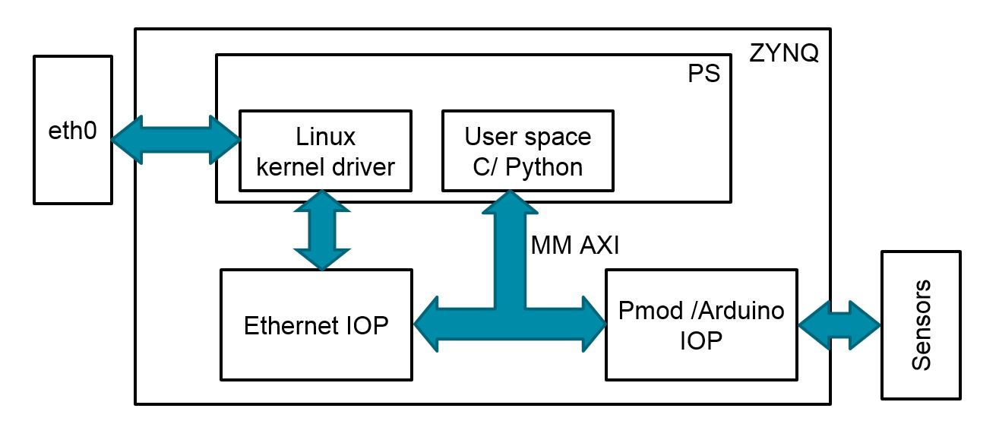

# PYNQ-Networking
PYNQ networking overlay enables networking capabilities from PL on the board.
Traditionally, the PS on ZYNQ board connects to the Ethernet port, while this 
overlay also bridges the PL on ZYNQ to the Ethernet port. MQTT-SN is 
implemented on this overlay, leveraging the `scapy` python library.



## Getting Started
To try this project, use the following command in a terminal:

```
sudo pip3.6 install --upgrade git+https://github.com/Xilinx/PYNQ-Networking.git
sudo reboot
```

After the setup, the notebook folder will be populated, and users can try
the demo there. Users do not have to run any additional steps.

For completeness, the following few sections introduces what have been done
starting from a PYNQ image V2.0 SD card.

## Boot Files
This overlay requires the boot files to be upgraded to Xilinx 2017.2 tool 
suite. For example, the device tree must have the following patch:

```
/ {
	chosen {
		bootargs = "console=ttyPS0,115200 root=/dev/mmcblk0p2 rw earlyprintk rootfstype=ext4 rootwait devtmpfs.mount=1 uio_pdrv_genirq.of_id=\"generic-uio\"";
		linux,stdout-path = "/amba@0/serial@E0001000";
	};

	amba {

		fabric@40000000 {
			compatible = "generic-uio";
			reg = <0x40000000 0x10000>;
			interrupt-parent = <&intc>;
			interrupts = <0x0 0x1d 0x4>;
		};

		ethernet@e000b000 {
			phy-handle = <&ethernet_phy>;
                        ethernet_phy: ethernet-phy@1{
				reg = <1>;
			};
		};

		slcr@f8000000 {
			clkc@100 {
				fclk-enable = <0xf>;
			};
		};
	};


	xlnk {
		compatible = "xlnx,xlnk-1.0";
		clock-names = "xclk0", "xclk1", "xclk2", "xclk3";
		clocks = <&clkc 0xf &clkc 0x10 &clkc 0x11 &clkc 0x12>;
	};
	usb_phy0: phy0 {
		compatible = "ulpi-phy";
		#phy-cells = <0>;
		reg = <0xe0002000 0x1000>;
		view-port = <0x170>;
		drv-vbus;
	};
   
};

&usb0 {
	usb-phy = <&usb_phy0>;
};
```
The ethernet entry must have bridging enabled as above.

Files in the boot partition compatible to 2017.2 tool suite are in 
`boot_files`. Users can replace the files in the boot partition of a PYNQ
image.

*Note: make a backup of the old files if necessary before replacing files!*

The source files to generate those boot files, are in 
`Pynq-Z1-defconfig`; 
this folder has several patches for the folder of the same name in `sdbuild`
of the mainline PYNQ repository. For example, `kernel.config` file enables the 
IP bridging functionality.

The Linux kernel is compiled using the following configuration 
(`Pynq-Z1-defconfig/config`, based on Xilinx Linux kernel 2017.2 release):
```
LINUX_REPO ?= https://github.com/Xilinx/linux-xlnx.git
LINUX_COMMIT ?= 5d029fdc257cf88e65500db348eda23040af332b
```
Note that the object file `kernel_module/pynqenet.ko` also has
to be compiled against this Linux kernel source.

## Installing Packages
There are several packages installed during the setup:

```shell
apt-get install tcpdump iptables ebtables bridge-utils
pip3.6 install scapy-python3 wurlitzer pytest-runner paho-mqtt
```

## Modifying `eth0` Port
Users have to modify the `eth0` port on Linux 
(`/etc/network/interfaces.d/eth0`). An example of the modified file is stored
in `interfaces.d` folder of this repository.

*Note: again, make a backup of the old files if necessary.*

## Wily Release
For Wily release of the Ubuntu system (15.10), please make sure the file
`/etc/apt/sources.list.d/multistrap-wily.list` looks like the following:

```
deb [arch=armhf] http://old-releases.ubuntu.com/ubuntu wily universe main
deb-src http://old-releases.ubuntu.com/ubuntu wily universe main
```

And run `apt-get update` before installing any package.
